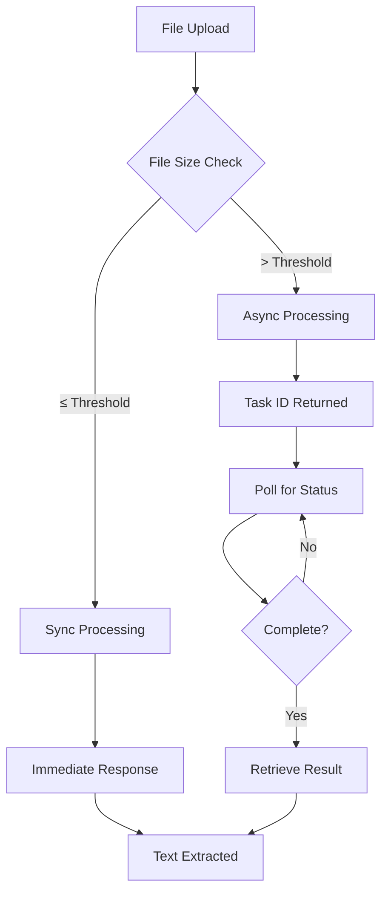

# Docling OCR Integration

## Overview

The Docling OCR integration provides advanced document processing capabilities for LibreChat, enabling intelligent text extraction and OCR (Optical Character Recognition) from various document formats. This integration supports both synchronous and asynchronous processing based on file size, with configurable OCR engines and output formats.

## Prerequisites

- LibreChat instance with file upload capabilities
- Docling OCR API access and API key
- Supported file formats: PDF, images (PNG, JPG, JPEG), and other document formats

## Configuration

### Basic Setup

To enable Docling OCR in your LibreChat instance, you need to configure both the OCR strategy and the Docling-specific settings.

#### 1. OCR Strategy Configuration

In your `librechat.yaml` file, set the OCR strategy to use Docling:

```yaml
ocr:
  strategy: "docling_ocr"
```

#### 2. Docling OCR Configuration

Add the Docling OCR configuration block to your `librechat.yaml`:

```yaml
doclingOcr:
  apiKey: "${DOCLING_API_KEY}"
  baseURL: "${DOCLING_BASE_URL}"
  syncThresholdMB: 5
  do_ocr: true
  force_ocr: false
  ocr_engine: "easyocr"
  ocr_lang: "en"
  output_format: "md"
```

## Environment Variables

Configure the following environment variables in your `.env` file:

### Required Variables

```bash
# API Authentication
DOCLING_API_KEY=your_docling_api_key_here
DOCLING_BASE_URL=https://docling.amendllc.com
```

### Optional Variables

```bash
# Processing Configuration
DOCLING_SYNC_THRESHOLD_MB=5  # File size threshold for sync vs async processing (MB)
DOCLING_DO_OCR=true          # Enable OCR processing
DOCLING_FORCE_OCR=false      # Force OCR over existing text extraction

# OCR Engine Configuration
DOCLING_OCR_ENGINE=easyocr   # OCR engine selection
DOCLING_OCR_LANG=en          # OCR language code (ISO 639-1)

# Output Format Configuration
DOCLING_OUTPUT_FORMAT=md     # Output format selection
```

## Configuration Options Reference

### Core Settings

| Option | Type | Default | Description |
|--------|------|---------|-------------|
| `apiKey` | string | **Required** | API key for Docling service authentication |
| `baseURL` | string | `https://docling.amendllc.com` | Base URL for the Docling API endpoint |
| `syncThresholdMB` | number | `5` | File size threshold (MB) for sync vs async processing |

### OCR Settings

| Option | Type | Default | Description |
|--------|------|---------|-------------|
| `do_ocr` | boolean | `true` | Enable OCR processing for documents |
| `force_ocr` | boolean | `false` | Force OCR processing even when text extraction is available |
| `ocr_engine` | string | `easyocr` | OCR engine to use for text recognition |
| `ocr_lang` | string | `en` | Language code for OCR processing (ISO 639-1) |

### Output Settings

| Option | Type | Default | Description |
|--------|------|---------|-------------|
| `output_format` | string | `md` | Output format for processed documents |

## OCR Engine Options

The following OCR engines are supported:

- **`easyocr`** - General-purpose OCR with good accuracy (recommended)
- **`ocrmac`** - macOS-specific OCR engine (macOS only)
- **`rapidocr`** - Fast OCR processing with good performance
- **`tesserocr`** - Tesseract OCR with Python bindings
- **`tesseract`** - Traditional Tesseract OCR engine

## Output Format Options

Choose from the following output formats:

- **`md`** - Markdown format (recommended for LibreChat)
- **`json`** - Structured JSON output with metadata
- **`html`** - HTML formatted output
- **`text`** - Plain text extraction
- **`doctags`** - Document with semantic tags

## Usage Examples

### Basic Configuration

Minimal setup for Docling OCR:

```yaml
ocr:
  strategy: "docling_ocr"

doclingOcr:
  apiKey: "${DOCLING_API_KEY}"
```

### Advanced Configuration

Full configuration with custom settings:

```yaml
ocr:
  strategy: "docling_ocr"

doclingOcr:
  apiKey: "${DOCLING_API_KEY}"
  baseURL: "https://your-custom-docling-instance.com"
  syncThresholdMB: 10
  do_ocr: true
  force_ocr: true
  ocr_engine: "tesserocr"
  ocr_lang: "es"
  output_format: "json"
```

### Multi-language Setup

For processing documents in multiple languages:

```yaml
doclingOcr:
  apiKey: "${DOCLING_API_KEY}"
  ocr_lang: "en+es+fr"  # Multiple languages
  ocr_engine: "easyocr"
  output_format: "md"
```

## File Processing Behavior

### Synchronous vs Asynchronous Processing

The integration automatically determines processing mode based on file size:

- **Files ≤ syncThresholdMB**: Processed synchronously (immediate response)
- **Files > syncThresholdMB**: Processed asynchronously (polling for completion)

### Processing Flow



## Error Handling

### Common Error Scenarios

1. **Authentication Errors**
   - Invalid API key
   - Expired credentials
   - Insufficient permissions

2. **Processing Errors**
   - Unsupported file format
   - File corruption
   - OCR processing failures

3. **Network Errors**
   - API endpoint unavailable
   - Timeout errors
   - Rate limiting

### Error Response Format

```json
{
  "error": {
    "message": "Error description",
    "type": "error_type",
    "code": "error_code"
  }
}
```

## Troubleshooting

### Configuration Issues

**Problem**: OCR not working
- **Solution**: Verify `ocr.strategy` is set to `"docling_ocr"`
- **Check**: Ensure `DOCLING_API_KEY` is properly set

**Problem**: Files not being processed
- **Solution**: Check file format support and size limits
- **Check**: Verify API endpoint accessibility

### Performance Issues

**Problem**: Slow processing
- **Solution**: Adjust `syncThresholdMB` for better async handling
- **Check**: Consider using faster OCR engines like `rapidocr`

**Problem**: High memory usage
- **Solution**: Lower `syncThresholdMB` to force async processing
- **Check**: Monitor file sizes and processing patterns

### API Issues

**Problem**: Authentication failures
- **Solution**: Verify API key validity and permissions
- **Check**: Ensure `baseURL` points to correct endpoint

**Problem**: Rate limiting
- **Solution**: Implement request throttling
- **Check**: Review API usage patterns and limits

## API Reference

### Endpoints Used

The integration uses the following Docling API endpoints:

- **POST** `/upload` - Synchronous file processing
- **POST** `/upload-async` - Asynchronous file processing
- **GET** `/status/{task_id}` - Check async task status
- **GET** `/result/{task_id}` - Retrieve async task result

### Request Format

```javascript
// Synchronous upload
const formData = new FormData();
formData.append('files', file);
formData.append('do_ocr', 'true');
formData.append('ocr_engine', 'easyocr');
formData.append('ocr_lang', 'en');
formData.append('output_format', 'md');
```

### Response Format

```json
{
  "document": {
    "filename": "document.pdf",
    "md_content": "# Document Title\n\nContent...",
    "json_content": {...},
    "html_content": "<h1>Document Title</h1>...",
    "text_content": "Document Title\n\nContent..."
  },
  "status": "completed",
  "errors": [],
  "processing_time": 2.5
}
```

## Security Considerations

- Store API keys securely using environment variables
- Use HTTPS for all API communications
- Implement proper error handling to avoid exposing sensitive information
- Consider file size limits to prevent abuse
- Monitor API usage and implement rate limiting if necessary

## Performance Optimization

### File Size Management

- Set appropriate `syncThresholdMB` based on your server capacity
- Use async processing for large files to avoid timeouts
- Consider file compression before processing

### OCR Engine Selection

- **For speed**: Use `rapidocr` or `easyocr`
- **For accuracy**: Use `tesserocr` or `tesseract`
- **For specific languages**: Test different engines for optimal results

### Output Format Selection

- **For LibreChat integration**: Use `md` format
- **For structured data**: Use `json` format
- **For minimal processing**: Use `text` format

## Migration from Other OCR Solutions

If migrating from other OCR strategies:

1. Update `ocr.strategy` to `"docling_ocr"`
2. Add Docling-specific configuration
3. Set environment variables
4. Test with sample documents
5. Adjust settings based on performance requirements

## Support and Resources

- **Documentation**: [LibreChat OCR Configuration](https://www.librechat.ai/docs/configuration/ocr)
- **API Documentation**: Contact Docling support for detailed API docs
- **Community**: LibreChat Discord and GitHub discussions
- **Issues**: Report bugs via LibreChat GitHub repository

## Version Compatibility

- **LibreChat**: v0.7.9+ 
- **Docling API**: v1.0+
- **Node.js**: 18.0+

---

*Last updated: January 2025*